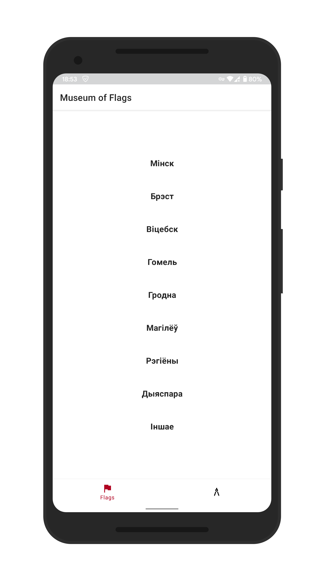
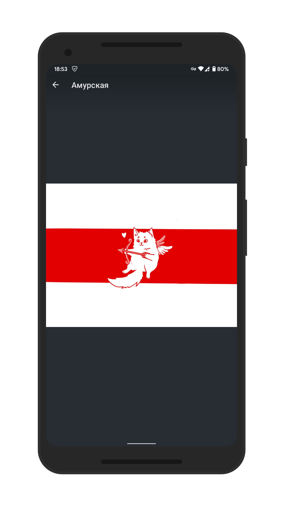

    

<h2 align="center">
    Belarus Resistance Flags
</h2>

Download
-------

Project characteristics 🚀
-------
This project brings to the table set of best practices, tools, and solutions:

* Android Jetpack Compose
* 100% [Kotlin](https://kotlinlang.org/)
* Single-activity architecture
* Dependency Injection ([Koin](https://github.com/InsertKoinIO/com.egoriku.landing.koin))
* Material Design
* Dark Theme

Built With 🛠
-------
- [Kotlin](https://kotlinlang.org/) - First class and official programming language for Android development.
- [Coroutines](https://kotlinlang.org/docs/reference/coroutines-overview.html) - Kotlin's way of way of writing asynchronous, non-blocking code
- [Android Architecture Components](https://developer.android.com/topic/libraries/architecture) - Collection of libraries that help you design robust, testable, and maintainable apps
- [Material Components for Android](https://github.com/material-components/material-components-android) - Modular and customizable Material Design UI components for Android
- [Koin](https://github.com/InsertKoinIO/com.egoriku.landing.koin) - Dependency Injection Framework
- [Google Analytics](https://firebase.google.com/docs/analytics) - Free app measurement solution that provides insight on app usage and user engagement
- [Firebase Crashlytics](https://firebase.google.com/docs/analytics) - Lightweight, realtime crash reporter that helps you track, prioritize, and fix stability issues that erode your app quality

App screenshots
-------

  

TODO
_______

1. Full screen flag view
2. Add separate icon for debug mode
3. Add ability to change app icon for safety
4. Add ability to download flags
5. Make Dze chat icon vector

License
-------

     Copyright 2020

     Licensed under the Apache License, Version 2.0 (the "License");
     you may not use this file except in compliance with the License.
     You may obtain a copy of the License at

         http://www.apache.org/licenses/LICENSE-2.0

     Unless required by applicable law or agreed to in writing, software
     distributed under the License is distributed on an "AS IS" BASIS,
     WITHOUT WARRANTIES OR CONDITIONS OF ANY KIND, either express or implied.
     See the License for the specific language governing permissions and
     limitations under the License.

